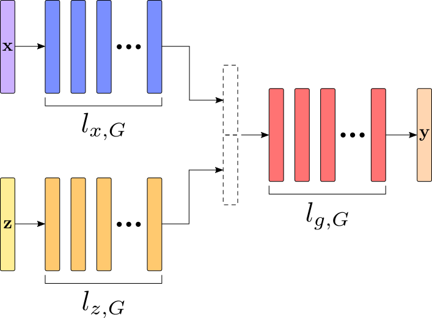
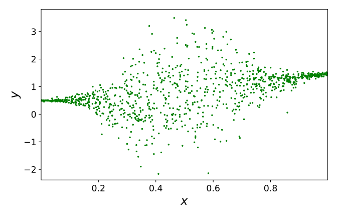
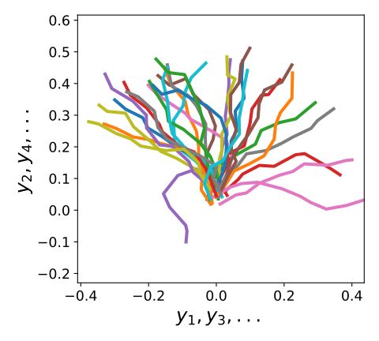

# Probabilistic Regression using CGANs
This repository contains code and datasets from the master thesis: [Probabilistic Regression using Conditional Generative Adversarial Networks](http://urn.kb.se/resolve?urn=urn:nbn:se:liu:diva-166637).
The project includes Conditional GANs (CGANs) used for low-dimensional probabilistic regression problems.

Author: [Joel Oskarsson](mailto:joel.oskarsson@liu.se), Linköping University

<p align="middle">
  
  
  
</p>

## Content
The repository includes pytorch implementations of the following models:
* Standard Conditional GANs ([Mirza et al.](https://arxiv.org/abs/1411.1784))
* Conditional f-GANs (based on [Nowozin et al.](https://arxiv.org/abs/1606.00709))
* Generative Moment Matching Networks ([Li et al.](https://arxiv.org/abs/1502.02761)) extended with conditioning
* Mixture Density Networks ([Christopher Bishop](https://www.microsoft.com/en-us/research/publication/mixture-density-networks/))
* Homoskedastic and heteroskedastic regression using neural networks
* Deep Conditional Target Densities ([Gustafsson et al.](https://arxiv.org/abs/1909.12297))

The repository also contains a number of synthetic datasets used for experiments in the thesis.
Multiple evaluation methods are implemented, including KDE-based log-likelihood and evaluation of CGANs using divergences proposed for training ([Im et al.](https://arxiv.org/abs/1803.01045)).

## Running the Code
The project uses Python 3.7.
All required python packages are listed with version numbers in `requirements.txt`.
The easiest way to install these is:
```
pip install -r requirements.txt
```
You probably want to use a virtual python environment, for example through [virtualenv](https://virtualenv.pypa.io/en/stable/) or [conda](https://docs.conda.io/en/latest/).

### Weights and Biases Integration
The project is fully integrated with [Weights & Biases](https://www.wandb.com/) (W&B) for logging and visualization, but can just as easily be used without it.
When W&B is used, training configuration, training/test statistics and plots are sent to the W&B servers and made available in an interactive web interface.
If W&B is turned off, logging instead saves everything locally to a directory like `wandb/dryrun-2020...`.
The W&B python package is installed together with the rest in `requirements.txt`.
The W&B project name is set to `cgan_regression`, but this can be changed in the first line of `constants.py`.
See the [W&B documentation](https://docs.wandb.com/) for details.

If you would like to login and use W&B, run:
```
wandb login
```
If you would like to turn off W&B and just log things locally, run:
```
wandb off
```

### Generating or Pre-processing Datasets
Synthetic datasets used in the thesis are directly available in the `datasets` directory.
If you would like to regenerate one of these, run:
```
python preprocess_dataset.py --dataset dataset_name
```
Real world datasets are not directly available in this repository.
Instructions for where to download each real dataset can be found as a comment in corresponding specification file, `dataset_specifications/dataset_name.py`.
To pre-process and save one of these in `datasets`, run:
```
python preprocess_dataset.py --dataset dataset_name --file path/to/dataset/file
```
Note that the `housing` dataset does not require a file path since the data is directly downloaded through sci-kit learn.
Including new datasets should be straightforward, starting from one of the existing specifications (for example `dataset_specifications/power.py` for a real world dataset).
Each dataset must also be listed in `dataset_list.py`.

### Configuring a Training or Test Run
Training and testing is done by running the `main.py` script with different arguments.
While it is possible to specify everything directly on the command line, it is far more convenient to create a JSON configuration file `config.json` and tell the script to read arguments from that:
```
python main.py --config config.json
```
To get a list of all available arguments run:
```
python main.py --help
```
They can also be found in `main.py` grouped by model.
Binary arguments that only turn features on or off are set using the integers 0/1.
Some of the most important arguments are:
* `train` Set to 1 or 0 for whether the model should be trained or not.
* `test` Set to 1 or 0 for whether the model should be evaluated on test data.
* `dataset` Name of the dataset to train/evaluate on. Needs to be generated/pre-processed and available in the `datasets` directory. See `dataset_list.py` for a list of all datasets.
* `model` Model to train/evaluate. See start of `main.py` for a list of all models.
* `network` Neural network architecture to use, for all models except CGANs. Should correspond to one of the files in `nn_specs` directory, without `.json`.
* `cgan_nets` Neural network architectures to use when model is CGAN. Should correspond to one of the files in `cgan_specs` directory, without `.json`.
* `cgan_type` Type of CGAN to train (training objective). See list at bottom of `models/cgan_versions.py` for available CGAN types.
* `noise_dim` Noise dimensionality for CGANs and GMMNs.
* `restore` W&B id of a previous run to restore model parameters (network weights etc.) from (when W&B is used).
* `restore_file` Path to a file to restore model parameters from. Can be used when W&B is turned off. The best model parameters from training are saved in the local W&B run directory.
* `epochs` The amount of epochs to train for. Note that only the model parameters from the best (in validation) epoch are saved. So in practice this specifies the maximum amount of epochs.

### Example Configs
Here follows some examples of configuration files.

Train a Mixture Density Network on the `bimodal` dataset for 200 epochs:
```json
{
"train": 1,
"test": 0,
"model": "mdn",
"dataset": "bimodal",
"network": "medium_nn",
"lr": 1e-3,
"optimizer": "adam",
"epochs": 200,
"mixture_comp": 10,
"l2_reg": 1e-4
}
```

Train a Pearson χ<sup>2</sup> CGAN for 1000 epochs on the `trajectories10` dataset:
```json
{
"train": 1,
"test": 0,
"model": "cgan",
"dataset": "trajectories10",
"cgan_type": "pearson",
"cgan_nets": "large_ni",
"noise_dim": 5,
"batch_size": 100,
"lr": 1e-4,
"optimizer": "rmsprop",
"epochs": 1000,
"val_interval": 5
}
```

Evaluate a CGAN on the `exponential` dataset, loading parameters from an earlier W&B run, also estimating "divergence" based on a Least Squares CGAN discriminator:
```json
{
"train": 0,
"test": 1,
"model": "cgan",
"dataset": "exponential",
"cgan_nets": "medium_ni",
"noise_dim": 5,
"restore": "fiopdk6g",
"test_runs": 10,
"eval_div": "ls",
"eval_cgan": "medium_ni",
"scatter": 1,
"lr": 1e-3,
"optimizer": "adam",
"epochs": 200
}
```

Evaluate a joint GMMN on the `const_noise` dataset, loading model parameters from a local file:
```json
{
"train": 0,
"test": 1,
"model": "gmmn",
"dataset": "const_noise",
"network": "medium_ni",
"noise_dim": 10,
"mmd_scales": "1,5,10",
"restore_file": "wandb/dryrun-20200514_101433-5mqvyivb/epoch_best.pt",
"test_runs": 10,
"scatter": 1
}
```

## Detailed Repository Structure
This is an explanation of each file and directory in the repository:
```
├── cgan_specs                  - Specifications of CGAN neural network architectures
│   └── ...
├── datasets                    - Available datasets, the actual data
│   └── ...
├── dataset_specifications      - Specifications describing different datasets
│   └── ...
├── images                      - A few example images from the thesis
│   └── ...
├── models
│   ├── cgan.py                 - General CGAN model
│   ├── cgan_versions.py        - Alternative CGAN versions (f-GANs, Least Squares, etc.)
│   ├── cgmmn.py                - CGMMN model
│   ├── dctd.py                 - Deep Conditional Target Densities model
│   ├── gmmn.py                 - GMMN model
│   ├── gp.py                   - Gaussian Process model
│   ├── mdn.py                  - Mixture Density Network model
│   ├── networks.py             - Neural network building blocks for other models
│   ├── nn_heteroskedastic.py   - Heteroskedastic neural network regression model
│   ├── nn.py                   - Base neural network model
│   ├── nn_regressor.py         - Homoskedastic neural network regression model
│   ├── noise_dists.py          - Noise distributions for generative models
│   └── spec_reader.py          - Network specification reader utility
├── nn_specs                    - Specifications of (non CGAN) neural network architecturs
│   └── ...
├── util_scripts                - Utility scripts for setting up experiments
│   └── ...
├── constants.py                - Constants
├── dataset_list.py             - List of avaliable dataset specifications
├── evaluation.py               - Code for evaluation steps in validation/testing
├── main.py                     - Main script used for training and testing
├── preprocess_dataset.py       - Script for generating/pre-processing datasets from specification
├── README.md                   - This readme file
├── requirements.txt            - List of required python packages
├── tabular_dataset.py          - Pytorch dataset class for tabular regression data
├── utils.py                    - Various utility functions
└── visualization.py            - Plotting functions
```
